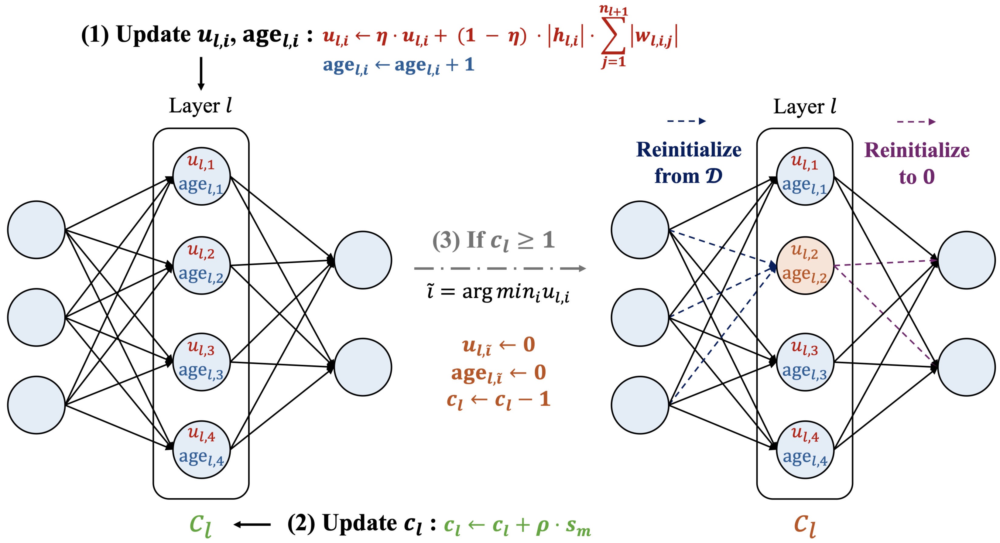
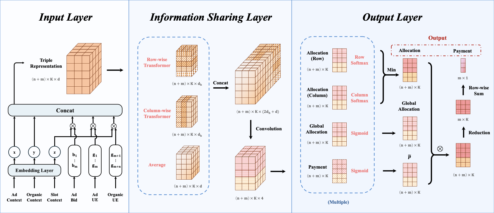








I hold a PhD from [Central South University](https://www.shanghairanking.com/institution/central-south-university), with my research focusing on robotic learning. Prior to this, I pursued my studies at [Tianjin University](https://www.shanghairanking.com/institution/tianjin-university). 

Currently, I am the founder and CEO of Airon Tech, an AI technology company. My vision is to bring AI to the ground, boost social efficiency, and benefit humanity.

# 💻 Work Experiences
- *2022.08 - 2025.07*：&nbsp;🇨🇳 *Zoomlion*, AI Scientist/Expert, Project Manager

  *- Project1: Bandit Optimization for Homepage Personalization in Online Retail*
  
- *2021.07 – 2021.08*: &nbsp;🇨🇳 *Alibaba*, Intern.

  *- Project: Robotic arm-based automated logistics system*

- *2020.05 – 2021.3*: &nbsp;🇺🇸 *Amazon*, Remote Intern.

  *- Project: Bandit Optimization for Homepage Personalization in Online Retail*
  
- *2017.01 – 2017.06*: &nbsp;🇨🇳 *Tencent*, Intern.

  *- Project: Optimization of User Gaming Experience Based on Reinforcement Learning*

# 🔥 About Airon

Airon is an enterprise service platform driven by artificial intelligence technology, providing data collection and annotation services, AI training services, and AI solution services to over one million enterprises and developers worldwide.

# 📈 News
- *2025.08.19*: &nbsp;🎉 Released the first “Trusted Data Space” product built on federated learning!

# 📝 Selected Projects

Glass Installation Robot

Developed the glass installation robot with autonomous alignment functionality, achieving an installation control accuracy of 3mm.

- *Two papers published*
  - [111](https://arxiv.org/pdf/2506.12389)ICRA'25
  - [High-Precision Automated Glass Installation Robot with Dual-Camera Visual Servoing Control](https://ieeexplore.ieee.org/abstract/document/10907684)ROBIO'24
  
- [**Watch our promotional video on YouTube!**](https://www.youtube.com/watch?v=lATSWn7t_Xc)

WWW 2025

[A Context-Aware Framework for Integrating Ad Auctions and Recommendations](https://dl.acm.org/doi/pdf/10.1145/3696410.3714779?casa_token=8lqAC8Liak8AAAAA:lbsi8gr5tQAQds4gSyTdM3a7Rl43lK1yXwjDzjOtcXOxydg_JQJfvJxQtUKGAPxbZNspu3OlGT5ZcQ)

Yuchao Ma, Weian Li, Yuejia Dou, **Zhiyuan Su**, Changyuan Yu, Qi Qi

- *Accepted at ACM The Web Conference (WWW) 2025* Poster

# 🎖 Honors and Awards
- *2023.01*: &nbsp;💰 Zoomlion Annual Outstanding Employee 中联年度优秀员工

# 🌍 Visitor Map

  
  
  
  

<footer class="site-footer">
  
&copy; 2025 Liwei Hou. All rights reserved.

  

    Template adapted from
    <a href="https://github.com/RayeRen/acad-homepage.github.io"
       target="_blank" rel="noopener">Yi Ren</a>.
  

</footer>
